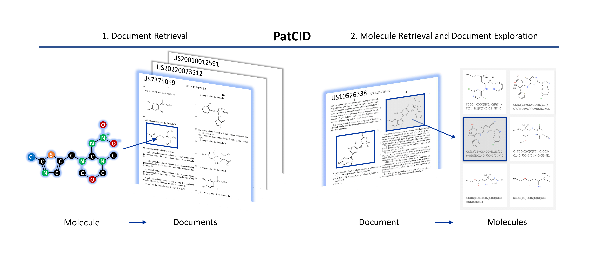

# PatCID

[](https://huggingface.co/datasets/ds4sd/USPTO-30K/)
[](https://huggingface.co/datasets/ds4sd/MolGrapher-Synthetic-300K)

This is the repository for [PatCID: an open-access dataset of chemical structures in patent documents]().



### Installation

Create a virtual environment.

```
conda create -n patcid python=3.11
conda activate patcid
```

Install dependencies.
```
pip install -e .
```

### Download PatCID Dataset 

The PatCID dataset is available on [Zenodo](https://doi.org/10.5281/zenodo.10572870).
```
wget https://zenodo.org/records/10572870/files/patcid.zip?download=1 -P ./data/patcid/
unzip ./data/patcid/patcid.zip
```

### Document Retrieval

Run the notebook `./examples/molecule_query.ipynb` to use PatCID to retrieve documents referencing a molecule of interest. 

### Molecule Retrieval

Run the notebook `./examples/patent_query.ipynb` to use PatCID to retrieve molecules displayed in a given patent document. 

### User Interface 

https://media.github.ibm.com/user/374154/files/9d14ac52-3d03-408a-8f97-1c34159ac26d

To request access to the above user interface, please contact the IBM's [Deep Search](https://ds4sd.github.io/) team at deepsearch-core@zurich.ibm.com.

### Benchmark Datasets

The benchmarks datasets D2C-UNI and D2C-RND are available on [Zenodo](https://doi.org/10.5281/zenodo.10978812).

### Code 

The code repositories used to build and evaluate PatCID are available:
- The [classification model](https://github.com/DS4SD/MolClassifier)
- The [recognition model](https://github.com/DS4SD/MolGrapher)
- The [chemical-structure annotation tool](https://github.com/DS4SD/MolAnnotator).

For segmenting chemical-structure images from documents, we use [DECIMER Segmentation](https://github.com/Kohulan/DECIMER-Image-Segmentation) from K. Rajan, H. O. Brinkhaus, M. Sorokina, A. Zielesny and C. Steinbeck.

### Models

The model weights are available on Hugging Face:
- The [classification model](https://huggingface.co/ds4sd/MolClassifier)
- The [recognition model](https://huggingface.co/ds4sd/MolGrapher).

### Training Datasets

The training datasets are available on Zenodo and Hugging Face:
- The [image classification model dataset](https://doi.org/10.5281/zenodo.10978564)
- The [molecule recognition model dataset](https://huggingface.co/datasets/ds4sd/MolGrapher-Synthetic-300K).

### Additional Visualization

To test our processing pipeline outside its main application domain, we process a [scientific publication](https://chemrxiv.org/engage/chemrxiv/article-details/662d287a91aefa6ce198f9b8) published on ChemRxiv. `./data/extra/scientific_paper_example/` contains the pages of the document (`page_*.png`) annotated with the segmentation and classification predictions. For pages containing molecules, the predicted molecules are provided in `page_*_molecules.txt`.

### Citation

If you find this repository useful, please consider citing:

```
TBD
```
